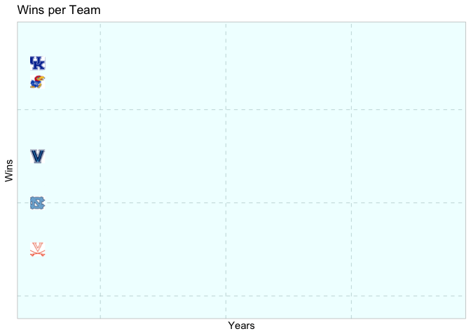
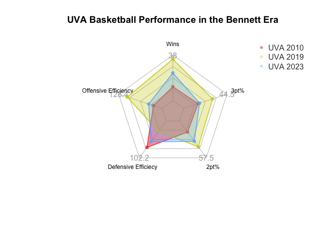
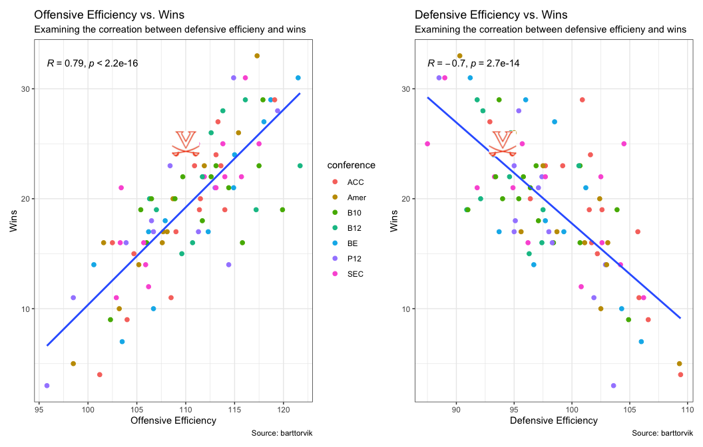
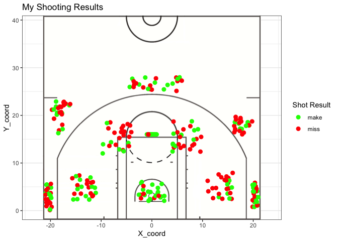
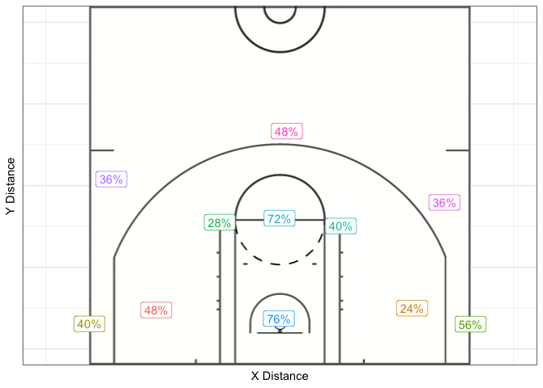
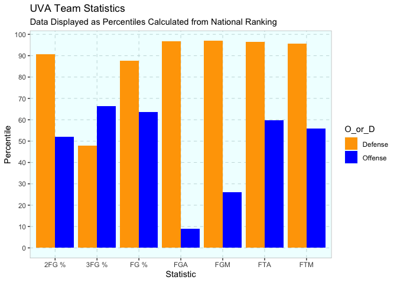

### UVA Basketball: Is it Time to Panic?

The University of Virginia’s basketball program has been very
competitive in the last decade. Since Tony Bennett took in the 2009-10
season, the trajectory of UVA’s performance has most been up. However,
with recent rule changes regarding the transfer portal, and the COVID
pandemic providing players with an extra year of eligibility, the
perception is that UVA has stumbled a bit in recent years after winning
a national championship in 2019. In this report, I take a look at the
data surrounding UVA’s performance since Tony Bennett took over, with an
added emphasis on their performance this year.

UVA’s basketball program has been very successful in the last decade, as
Tony Bennett has established the school as a prominent program. In the
visual above, I compared UVA’s yearly win totals to the stereotypical
“blue blood” programs: Duke, UNC, Kentucky, Kansas, and Villanova. As
you can see in the visual, UVA has performed very comparably to these
programs in the Tony Bennett era. UVA has consistently put up 20+ win
seasons, including multiple 30 win seasons. It is important to note that
the COVID season (2020) was cut short, so win totals are lower for all
teams. But even the last few seasons have not been entirely bad, with
some fairly high win totals. While there is no doubt that UVA had a
great stretch of seasons in the last decade, fans have begun to worry a
bit. The 2019 team set such high standards that anything less than that
success has seemed like a failure, and UVA has unfortunately been the
victims of first round tournament upsets in their last two trips, as
well as missing the NCAA Tournament entirely. The lack of postseason
success on a national level is most likely at the heart of the
negativity currently surrounding the program’s performance, so it is
important to look at which areas of the team’s performance have changed
in recent years.

The above visual shows a comparison of three UVA teams in the Tony
Bennett era. The 2010 team was his first season as head coach which came
after a few tumultuous years. The 2019 team won the national
championship, turning in 35 wins. And the 2023 team is the most recent
team, who despite grabbing a share of the ACC regular season title,
crashed out of the first round of the NCAA tournament to 13th seeded
Furman in spectacular fashion. This visual examines 5 aspects of the
teams’ performance: offensive and defensive efficiencys, two point and
three point shooting percentages, and win totals. It is important to
note that a lower defensive efficiency is better. As you can see, the
championship winning team in 2019 performed better in all aspects
examined here, followed by the 2023 team, and lastly the 2010 team.
While people were generally underwhelmed by the success of the 2023
squad, they still performed much better than the 2010 team, so the
program improvements made by Tony Bennett are still there to see.
However, there were significant dips in defensive efficiency and 3 point
shooting from 2019 to 2023, two staples of the Tony Bennett coaching
style. These performance dips can definitely be looked at as causes of
the difference in wins and overall success and the important of the
efficiency metrics can be seen in the next visual.

Above are two visuals analyzing the correlation between defensive
efficiency and offensive efficiency with wins for college basketball
programs in the 2023 season. As you can see, the correlations are fairly
high, indicating that these metrics are important factors in predicting
team performance. Based on these visuals, the dips in offensive and
defensive efficiency from UVA’s 2019 team to their 2023 team is not
great and probably a large part of the 2023 team winning 10 less games.
You can also see that in these visuals, UVA is still above average in
wins and defensive efficiency, and are about average in offensive
efficiency. UVA has never been known for their offense under Tony
Bennett, but its good to know that the defense is still strong compared
to the rest of the nation, despite taking a dip in recent years, and as
the old adage goes, defense wins championships.

To try and understand how important defense is, I decided to calculate
my own shooting percentages in the gym. At times as a UVA fan, it is
frustrating to watch their offense shoot the ball. As previously stated,
they are not known for their offense, and college basketball players in
general are inefficient shooters. However, to win games, the ball needs
to be put in the basket, and UVA make it look difficult at times, with
scoring droughts a constant issue in games. Now there are obvious
differences in the environment that I took my shots in, and a realistic
game situation. I did my best to take difficult shots one would take in
a game, whether i was catching a pass and shooting instantly, stepping
back, pulling up off the dribble, or driving layups against my friend,
but obviously these shots are a lot easier without any pressure and
limited defense. However, I have also only played a sparing amout of
competitive basketball, so I should not be able to shoot the way college
players can. As you can see, I made roughly 40% of my three point shots,
and about 40% of my shots in total. Fatigue was definitely a factor in
the 2 point shooting, as taking 275 shots in the span of about an hour
was tiring. But the main takeaway I came away with was that if I,
someone with next to no basketball experience, could shoot 40% from
three, imagine how well a division one college player could shoot if
given the time and space I had. This goes back to defense, and lazy
teams that don’t bother to play good defense and close out shots will
get punished, which is why Tony Bennett puts such a great emphasis on
defense.

Above are comparisons between the shooting percentage of me and the UVA
basketball player from the 2023 season. As you can see, I shot fairly
comparably in all areas, even a little bit better than the team from 3,
which can largely be attributed to the environmental differences I
explained before (lack of defense and pressure on me). As you can see,
there are only two UVA players that were above 35% from three, and the
team shot under 40%. This makes it hard to open up leads, cut down
deficits, and go on scoring runs that win basketball games. It certianly
wasn’t UVA’s best season ever from an offensive perspective, but when
compared to other teams around the nation, its easy to see why they were
a 25 win team.

The above visual shows UVA’s percentile ranking in certain statistics in
the 2023 season compared to other teams. As you can see, the team is
remarkably high in almost every defensive category examined here, as
they are above the 90th percentile in 5 categories. The offensive field
goals made and attempted is alarming, which goes back to the previously
discussed offensive woes, but the defense provides such a great
foundation for the program.

The success of UVA’s 2023 season and the program as a whole since Tony
Bennett took over is being downplayed in large part due to their lack of
postseason success in recent years. While the statistics show that the
team has taken a dip in performance since it’s peak in 2019, the
foundation of stifling defense is still their, and that will continue to
provide the program with 20 win seasons as it has done since Bennett
arrived. While the new transfer rules will require some adaptation to
the recruiting strategy, there is no reason to panic yet, as UVA had
established itself as a top tier program that will continue to
manufacture winning seasons.
